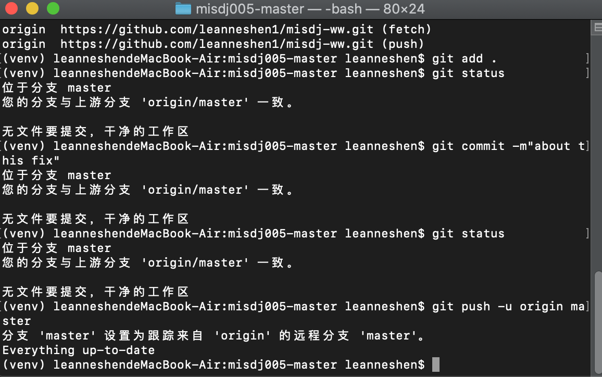
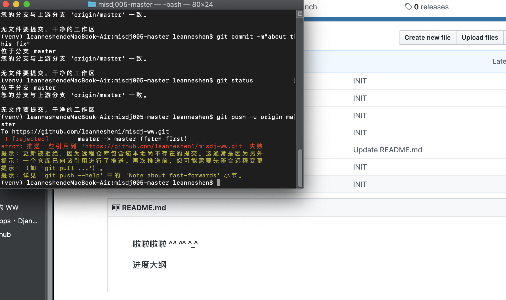
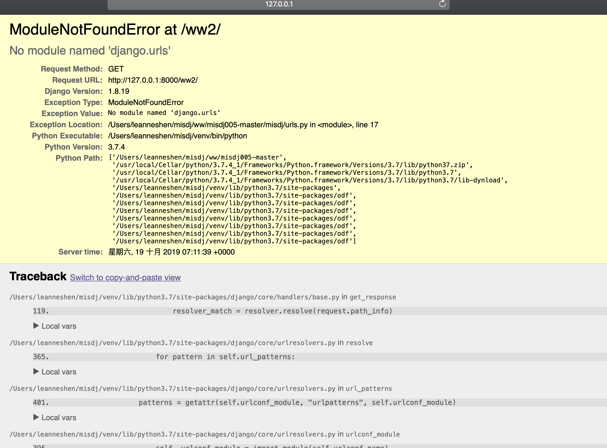
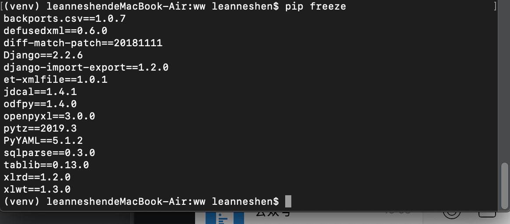
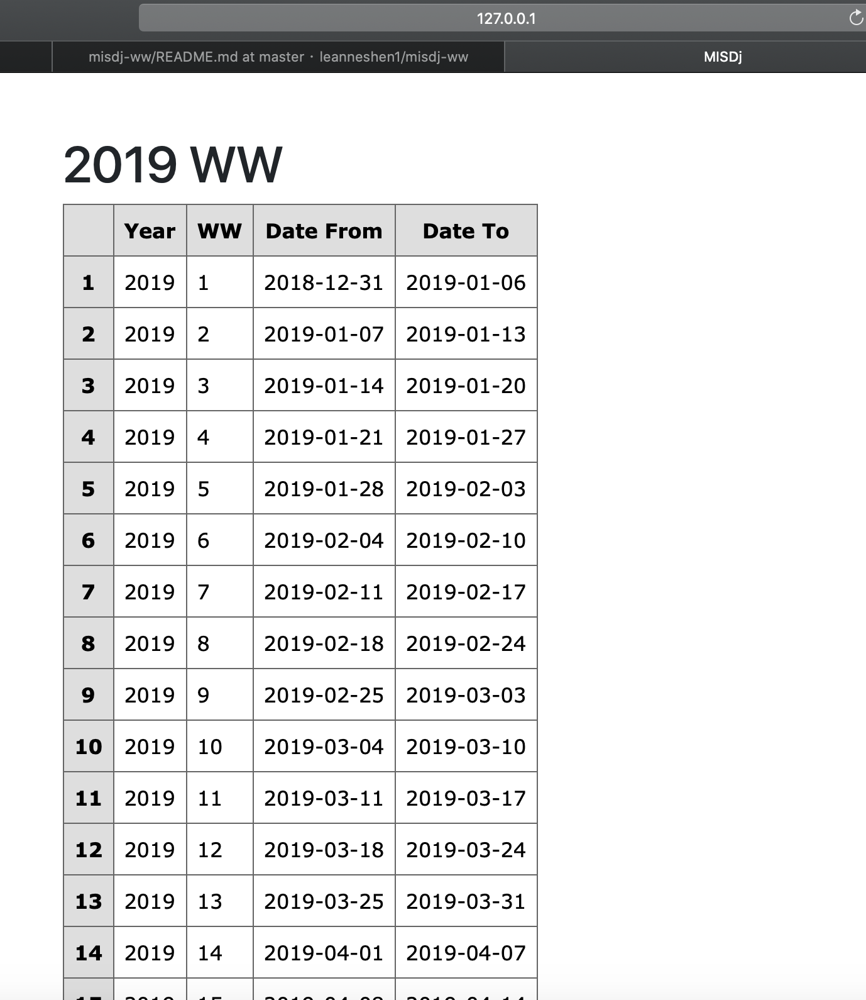
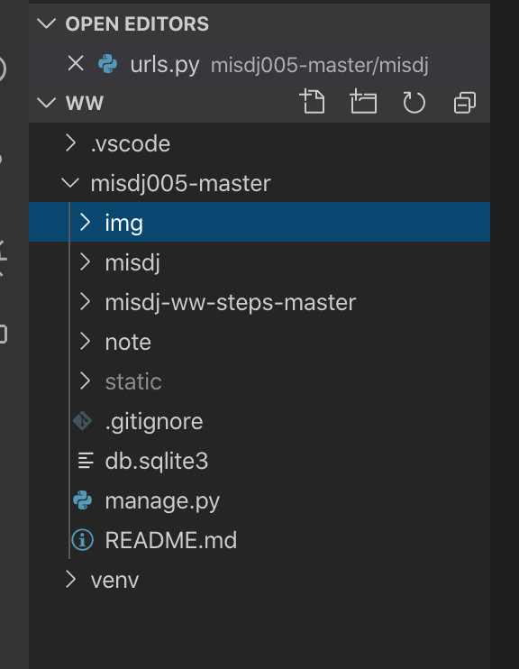

https://www.cnblogs.com/sunnydou/p/5801760.html

## pip freeze 的結果如下
```
(venv) leanneshendeMacBook-Air:ww leanneshen$ pip freeze
backports.csv==1.0.7
defusedxml==0.6.0
diff-match-patch==20181111
Django==2.2.6
django-import-export==1.2.0
et-xmlfile==1.0.1
jdcal==1.4.1
odfpy==1.4.0
openpyxl==3.0.0
pytz==2019.3
PyYAML==5.1.2
sqlparse==0.3.0
tablib==0.13.0
xlrd==1.2.0
xlwt==1.3.0

```

## 我的工作目錄是  pwd
```
(venv) leanneshendeMacBook-Air:ww leanneshen$ pwd
/Users/leanneshen/misdj/ww

```

## 新建  app, ./manage.py startapp case001
```
(venv) leanneshendeMacBook-Air:misdj005-master leanneshen$ ./manage.py startapp case001

```


## 20191119 工作环境设定及遇到的问题

1. 本地代码上传
  
  a. 在本地代码与GitHub两边内容一模一样时，尝试终端五步上传，系统则提示没有可更新内容




  b. 尝试在本地READme中添加文字“进度大纲”后重新上传，则提示有更新



2. 命令确认好后，到服务器端确认之前可以运行的 http://127.0.0.1:8000/ww2 是否可正常运行

  a. 运行失败，显示错误信息如下:
  
 
 
  b. 经过确认，发现目前使用的Django版本是1.8.19
  
 
  
  c. 重新安装 pip install django
             pip install django-import-export
     后运行 pip freeze 结果如下
     
 
 
  d. 确认版本正确后，重新确认服务器端http://127.0.0.1:8000/ww2 的运行情况

 
 
3. 在本地编译器ww目录下添加img文件夹，用来存放本地需要上传的图片
 
 
 
4. 新建  app, ./manage.py startapp case001
   在case001/models 下添加
```
from django.db import models
class Data1(models.Model):
    date1 = models.DateField()
    place = models.CharField(max_length=100)
    worker = models.CharField(max_length=100)
    thing = models.CharField(max_length=100)
```
 

